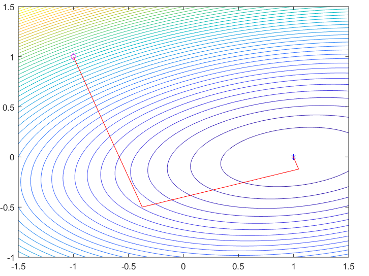
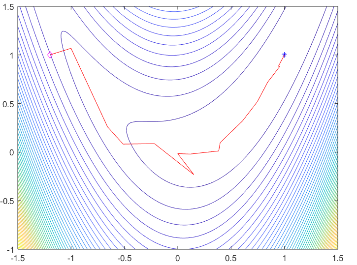
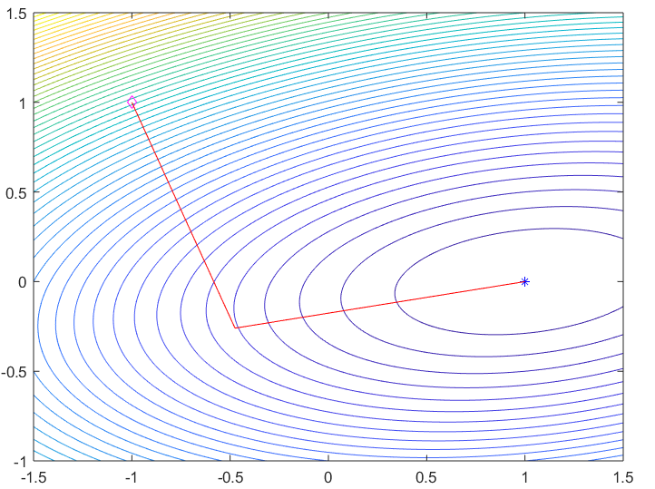

### Part 1

Note that $A + U V^\top$ is invertible if and only if $(A + U V^\top)x = 0$ implies $x = 0$ for $x \in \mathbb{R}^N$.

Consider $y$ such that $(A + U V^\top)y = 0$.

We have assumed that $A$ is invertible and therefore that $A^{-1}$ exists; then, left-multiplying by $V^\top A^{-1}$,

$$ \begin{aligned}
0 &= V^\top A^{-1} (A + U V^\top) y \\
&= V^\top y + V^\top A^{-1} U V^\top y \\
&= (I + V^\top A^{-1} U) V^\top y
\end{aligned} $$

Since $(I + V^\top A^{-1} U)$ is invertible by assumption, we must have that $V^\top y = 0$. Then

$$
0 = (A + U V^\top) y = A y
$$

and therefore $y = 0$, since A is invertible. Hence $A + U V^\top$ is invertible.

Subsequently observe that

$$ \begin{aligned}
&(A + U V^\top) \left( A^{-1} - A^{-1} U (I + V^\top A^{-1} U)^{-1} V^\top A^{-1} \right) \\
&= I - U (I + V^\top A^{-1} U)^{-1} V^\top A^{-1} + U V^\top A^{-1} - U V^\top A^{-1} U (I + V^\top A^{-1} U)^{-1} V^\top A^{-1}) \\
&= I + U \left( -(I + V^\top A^{-1} U)^{-1} + I - V^\top A^{-1} U (I + V^\top A^{-1} U)^{-1} \right) V^\top A^{-1} \\
&= I + U \left( I - (I + V^\top A^{-1} U)(I + V^\top A^{-1} U)^{-1} \right) V^\top A^{-1} \\
&= I
\end{aligned} $$

and therefore

$$
A^{-1} - A^{-1} U (I + V^\top A^{-1} U)^{-1} V^\top A^{-1} = (A + U V^\top)^{-1}
$$


### Part 2

#### (a)

Let $z \in \mathbb{R}^N$. Using the definition of $B_{n+1}$ and the $B_n$-norm,

$$ \begin{aligned}
z^\top B_{n+1} z &= z^\top \left( B_n - \frac{(B_n d_n)(B_n d_n)^\top}{d_n^\top B_n d_n} + \frac{y_n y_n^\top}{y_n^\top d_n} \right) z \\
&= z^\top B_n z - \frac{z^\top B_n d_n d_n^\top B_n z}{d_n^\top B_n d_n} + \frac{z^\top y_n y_n^\top z}{y_n^\top d_n} \\
&= \lVert z \rVert_{B_n}^2 - \frac{(z^\top B_n d_n)^2}{\lVert d_n \rVert_{B_n}^2} + \frac{(y_n^\top z)^2}{y_n^\top d_n} \\
\end{aligned} $$

Consider now the Cauchy-Schwarz inequality, which holds since $B_n$ is SPD by assumption, and which ensures that

$$
z^\top B_n d_n \leq \lVert z \rVert_{B_n} \lVert d_n \rVert_{B_n}
$$

Therefore

$$ \begin{aligned}
z^\top B_{n+1} z &\geq \lVert z \rVert_{B_n}^2 - \frac{\lVert z \rVert_{B_n}^2 \lVert d_n \rVert_{B_n}^2}{\lVert d_n \rVert_{B_n}^2} + \frac{(y_n^\top z)^2}{y_n^\top d_n} \\
&= \frac{(y_n^\top z)^2}{y_n^\top d_n} \\
&\geq 0
\end{aligned}
$$

since it was assumed that $y_n^\top d_n \ge 0$. This assumption necessitates that $y \neq 0$, meaning that equality only holds when $z = 0$.

Hence we have shown that $z^\top B_{n+1} z \geq 0$ for any $z \in \mathbb{R}^N$, and $z^\top B_{n+1} z = 0$ if and only if $z = 0$. In other words, $B_{n+1}$ is positive definite.


#### (b)

TODO


### Part 3

_(Please see Appendix for associated code)_

In this section we attempt to find an approximate minimum of the quadratic function $f(x) = \frac{1}{2} x^\top A x + b^\top x$ on $\mathbb{R}^2$, where

$$
A = \begin{pmatrix} 2 & -1 \\ -1 & 10 \end{pmatrix} \qquad b = \begin{pmatrix} -2 \\ 1 \end{pmatrix}
$$


The quasi-Newton BFGS algorithm is used to iteratively update an initial guess $x_0$. A descent direction is calculated and the step size $\alpha$ in that direction can be determined by a line search algorithm - in this case, backtracking line search, which starts with a relatively large initial guess for $\alpha$ and then halves it until the descent condition is met:

$$
f(x + \alpha s) - f(x) < \theta_{sd} \alpha (f'(x)^\top s)
$$

for some specified constant $\theta_{sd}$. From previous work, we know $f'(x) = A x + b$.

The following table shows the number of iterations the algorithm completes before convergence is achieved for a range of starting guesses $x_0$, using $\theta_{sd} = 0.1$, an initial approximate Hessian $B_0 = I$ and a convergence tolerance of $\epsilon = 10^{-5}$. The number of iterations performed by steepest descent (also with backtracking line search) and a simple Cauchy point trust region method are also shown.


$x_0^\top$  | BFGS (backtracking) | Steepest descent | Trust region
------------|---------------------|------------------|-------------
(1, 0)      | 0                   | 0                | 0
(0, 0)      | 4                   | 28               | 30
(-1, 1)     | 4                   | 31               | 24
(-2, 1)     | 4                   | 31               | 24
(-5, -5)    | 5                   | 33               | 41
(1e8, -1e8) | 9                   | 70               | 1000000+ (did not converge)


The BFGS algorithm converges with many fewer iterations than either of the comparative algorithms; although despite the additional iterations, for this problem the other algorithms converge at more or less the same speed as the BFGS algorithm (~0.3 seconds for the starting guesses above), likely due to the additional work being done to update the approximate Hessian matrix at each BFGS iteration. It should however be noted that this is a fairly simple problem, and therefore convergence is achieved in a short period of time; greater discrepancies between the algorithms might be seen for higher-dimensional problems.

The solution path of the BFGS algorithm with an initial guess of $x_0 = (-1, 1)^\top$ is shown in Figure 1.


{width=80%}


### Part 4

_(Please see Appendix for associated code)_

Similarly to Part 3, we now attempt to find an approximate minimum of the Rosenbrock function $f(x) = (1 - x_1)^2 + 10(x_2 - x_1^2)^2$ using the BFGS algorithm. However, in our search for the step size $\alpha$ at each iteration, we replace backtracking line search with Wolfe line search. Rather than simply reducing $\alpha$ until a suitable value is reached, Wolfe line search iteratively adjusts $\alpha$ by making increases or decreases (or a combination of both) until the following conditions, dependent on two specified parameters $\theta_{sd}$ and $\theta_c$, are both met:

$$ \begin{aligned}
&\textbf{Armijo condition} & &f(z + \alpha s) \leq f(z) + \theta_{sd} \alpha (f'(z)^\top s) \\
&\textbf{Curvature condition} & &f'(z + \alpha s)^\top s \geq \theta_c (f'(z)^\top s)
\end{aligned} $$

As before, we compare the rate of convergence with the steepest descent (with backtracking) and trust region methods, though this time only for a pair of starting guesses.


$x_0^\top$  | BFGS (Wolfe) | Steepest descent | Trust region
------------|--------------|------------------|-------------
(1, 1)      | 0            | 0                | 0
(-1.2, 1)   | 19           | 1106             | 1006
(-1.2, 1.5) | 15           | 1104             | 961


Note that in terms of iterations, the improved BFGS method converges an order of magnitude faster than the other methods; although it is once again the case that all three algorithms converge in a similar period of time (~0.1 seconds, most likely for similar reasons to those discussed in Part 3.

The solution path of the BFGS algorithm using Wolfe line search, with an initial guess of $x_0 = (-1.2, 1)^\top$, is shown in Figure 2.


{width=80%}


### Part 5

#### (a)

Let $n < N$, $0 \leq k \leq n$ and let $j$ be arbitrarily chosen such that $0 \leq j \leq k$, $B_k$ be defined iteratively via the BFGS method with exact line search, and $B_0 = I$.

Observe that, using the form of the BFGS update,

$$ \begin{aligned}
B_1 d_j &= \left( B_0 - \frac{(B_0 d_j) (B_0 d_j)^\top}{d_j^\top B_0 d_j} + \frac{y_j y_j^\top}{y_j^\top d_j} \right) d_j \\
&= \left( I - \frac{d_j d_j^\top}{d_j^\top d_j} + \frac{y_j y_j^\top}{y_j^\top d_j} \right) d_j \\
&= d_j - \frac{d_j d_j^\top d_j}{d_j^\top d_j} + \frac{y_j y_j^\top d_j}{y_j^\top d_j} \\
&= d_j - d_j + y_j \\
&= y_j
\end{aligned} $$

Then if we assume that $B_k d_j = y_j$, note that

$$ \begin{aligned}
B_{k+1} d_j &= \left( B_k - \frac{(B_k d_j) (B_k d_j)^\top}{d_j^\top B_k d_j} + \frac{y_j y_j^\top}{y_j^\top d_j} \right) d_j \\
&= B_k d_j - \frac{(B_k d_j) (B_k d_j)^\top d_j}{d_j^\top B_k d_j} + \frac{y_j y_j^\top d_j}{y_j^\top d_j} \\
&= y_j - \frac{y_j y_j^\top d_j}{y_j^\top d_j} + y_j \\
&= y_j - y_j + y_j \\
&= y_j
\end{aligned} $$

Since $j$ was arbitrary, we now have by induction that $B_{k+1} d_j = y_j$ for all $0 \leq j \leq k$, for all $0 \leq k \leq n$.


#### (b)

TODO


#### (c)

_(Please see Appendix for associated code)_

Returning to the quadratic problem defined in Part 3, we now use exact line search instead of backtracking line search at each step; i.e. we choose our step $\alpha$ to be

$$
\alpha = \inf \left\{ a \geq 0 \ : \ \phi'(a) = 0 \right\}
$$

where we define $\phi(a) = f(x + as)$. Note that $\phi'$ here is the derivative of $\phi$ with respect to $a$, and so by the chain rule,

$$
\phi'(a) = \frac{d}{da} f(x + as) = f'(x + as)^\top s
$$

The problem in question is 2-dimensional ($N = 2$), and therefore we expect that the algorithm will always terminate in at most two iterations. The following table shows that this is indeed the case for the range of initial guesses which were considered in Part 3. The "final error" is the Euclidean norm of the difference between the final iteration $x$ and the exact solution $x^* = (1, 0)^\top$.


$x_0^\top$  | Iterations | Final error
------------|------------|-------------
(1, 0)      | 0          | 0.000000e+00
(0, 0)      | 2          | 2.775558e-17
(-1, 1)     | 2          | 1.110223e-16
(-2, 1)     | 2          | 1.665335e-16
(-5, -5)    | 2          | 0.000000e+00
(1e8, -1e8) | 2          | 1.535977e-08


The solution path of the BFGS algorithm with exact line search, starting from an initial guess of $x_0 = (-1, 1)^\top$, is shown in Figure 3.


{width=80%}


\pagebreak


## Appendix

#### `bfgs.m`

```{octave bfgs, eval = FALSE}
function all_x = bfgs(f, df, x0, B0, theta, tol)
% Performs generalised steepest descent, using the BFGS method to update
% an approximate Hessian matrix and returning a matrix of all iterates

% Only permit a certain maximum number of iterations
max_iters = 1000;
% Ensure dimensions of inputs are correct
[m, n] = size(x0);
if n ~=  1
    error("x0 must be a n*1 vector")
elseif ~isequal(size(B0), [m, m])
    error("B0 must be square and have same dimension as x0")
end

% Prepare array to store iterates
all_x = NaN(m, max_iters+1);
all_x(:, 1) = x0;

% Set initial guesses
x = x0;
H = inv(B0);

for k = 1:max_iters
    
    % Check convergence
    if norm(df(x)) <= tol
        break
    end
    
    s = - H * df(x);
    
    % Find step size via linesearch
    alpha = linesearch(x, f, df, s, theta);
    
    % Calculate new iterate and useful vectors
    d = alpha .* s;
    y = x;
    x = x + d;
    y = df(x) - df(y);
    
    % Store new iterate
    all_x(:, k+1) = x;
    
    % Update H using SMW/BFGS method
    rho = 1 / (y'*d);
    H = (eye(m) - rho*(d*y')) * H * (eye(m) - rho*(y*d')) + rho*(d*d');
end

% Return all iterates
all_x = all_x(:, 1:k);
end
```


#### `wlinesearch.m`

```{octave wlinesearch, eval = FALSE}
function alpha = wlinesearch(x, f, df, s, theta_sd, theta_c)
% Backtracking line search algorithm which guarantees Wolfe conditions

% Check parameters are valid
if 0 >= theta_sd || theta_sd >= theta_c || theta_c >= 1
    error("Please specify 0 < theta_sd < theta_c < 1")
end
    
% Initialise alpha and auxiliary variables
alpha = 1;
a1 = 0;
a2 = 0;

% Define indicator functions for Wolfe convergence conditions
armijo = @(z, a) f(z + a*s) <= f(z) + theta_sd*a*(df(z)'*s);
curvature = @(z, a) df(z + a*s)'*s >= theta_c*(df(z)'*s);

% Adjust alpha until the conditions are satisfied; stop after a while
for k = 1:100

    if ~armijo(x, alpha)
        % Reduce alpha
        a2 = alpha;
        alpha = 0.5*(a1 + a2);
        
    elseif ~curvature(x, alpha)
        % Increase alpha
        a1 = alpha;
        if a2 == 0
            alpha = 2*a1;
        else
            alpha = 0.5*(a1 + a2);
        end
        
    else
        % We satisfied both conditions!
        break
        
    end
    
end
end
```


#### `bfgs_ex.m`

```{octave bfgs_ex, eval = FALSE}
function all_x = bfgs_ex(f, df, x0, B0, tol)
% Performs generalised steepest descent, using the BFGS method to update
% an approximate Hessian matrix and returning a matrix of all iterates

% Only permit a certain maximum number of iterations
max_iters = 1000;
% Ensure dimensions of inputs are correct
[m, n] = size(x0);
if n ~=  1
    error("x0 must be a n*1 vector")
elseif ~isequal(size(B0), [m, m])
    error("B0 must be square and have same dimension as x0")
end

% Prepare array to store iterates
all_x = NaN(m, max_iters+1);
all_x(:, 1) = x0;

% Set initial guesses
x = x0;
H = inv(B0);

for k = 1:max_iters
    
    % Check convergence
    if norm(df(x)) <= tol
        break
    end
    
    s = - H * df(x);
    
    % Implement SLOW exact line search: as long as f is decreasing,
    % increase alpha by a small amount
    %alpha = 0;
    %inc = 1e-6;
    %while f(x + alpha*s) > f(x + (alpha + inc)*s)
    %    alpha = alpha + inc;
    %end
    
    % Succinct version of the above: using MATLAB's `fzero()` to find
    %   inf{alpha >= 0 : p'(alpha) = 0}
    % where p(alpha) = f(x + alpha*s)
    alpha = fzero(@(a) s'*df(x + a*s), 0);
    
    % Calculate new iterate and useful vectors
    d = alpha .* s;
    y = x;
    x = x + d;
    y = df(x) - df(y);
    
    % Store new iterate
    all_x(:, k+1) = x;
    
    % Update H using SMW/BFGS method
    rho = 1 / (y'*d);
    H = (eye(m) - rho*(d*y')) * H * (eye(m) - rho*(y*d')) + rho*(d*d');
end

% Return all iterates
all_x = all_x(:, 1:k);
end
```
